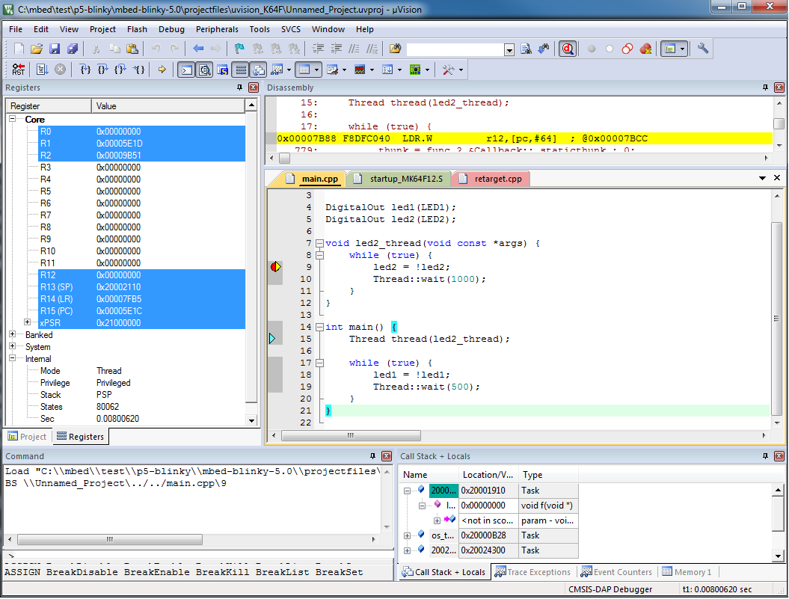

# Getting started with Blinky on mbed OS

This is a very simple guide, reviewing the steps required to get Blinky working on an mbed OS platform.

Please install [mbed CLI](https://github.com/ARMmbed/EPR-Getting-Started#setting-up-your-environment).

## Get the example application!

From the command line, import the example:

```
$ mbed import mbed-os-example-blinky
$ cd mbed-os-example-blinky
```

### Now compile

Invoke `mbed compile` specifying the name of your platform and your favorite toolchain (`GCC_ARM`, `ARM`, `IAR`):

```
$ mbed compile -m K64F -t GCC_ARM
```

Your PC may take a few minutes to compile your code. At the end you should get the following result:

```
[snip]
+----------------------------+-------+-------+------+
| Module                     | .text | .data | .bss |
+----------------------------+-------+-------+------+
| Fill                       |   176 |     4 | 2246 |
| Misc                       | 37291 |  2224 | 2160 |
| core/hal                   | 15448 |    16 |  568 |
| core/rtos                  |  7318 |    24 | 2662 |
| features/FEATURE_IPV4      |    96 |     0 |   48 |
| frameworks/greentea-client |  1561 |    52 |   52 |
| frameworks/utest           |  2988 |     0 |  732 |
| Subtotals                  | 64878 |  2320 | 8468 |
+----------------------------+-------+-------+------+
Allocated Heap: 65540 bytes
Allocated Stack: 32768 bytes
Total Static RAM memory (data + bss): 10788 bytes
Total RAM memory (data + bss + heap + stack): 109096 bytes
Total Flash memory (text + data + misc): 68238 bytes
Image: .\.build\K64F\GCC_ARM\mbed-os-blinky.bin                  
```

### Program your board

1. Connect your mbed device to the computer over USB.
1. Copy the binary file to the mbed device .
1. Press the reset button to start the program.

You should see the LED of your platform turning on and off.

Congratulations if you managed to complete this test!

## Export the project to Keil MDK and debug your application

From the command line, run the following command:

```
mbed export -m K64F -i uvision -n mbed-os-example-blinky
```

You should see the following output:

```
Successful exports:
  * K64F::uvision       .\projectfiles\uvision_K64F\mbed-os-example-blinky
```

To debug the application:

1. Start MDK.
1. Import the uVision project generated earlier.
1. Compile your application and generate an `.axf` file.
1. Make sure uVision is configured to debug over CMSIS-DAP (From the Project menu > Options for Target '...' > Debug tab > Use CMSIS-DAP Debugger).
1. Set breakpoints and start a debug session.



## Troubleshooting

1. Make sure `mbed-cli` is working correctly and its version is greater than `0.8.0`

 ```
 mbed-cli --version
 ```

 If not, you can update it easily:

 ```
 pip install mbed-cli --upgrade
 ```

2. If using Keil MDK, make sure you have a license installed. There is a 32KB restriction for evaluation licenses.
